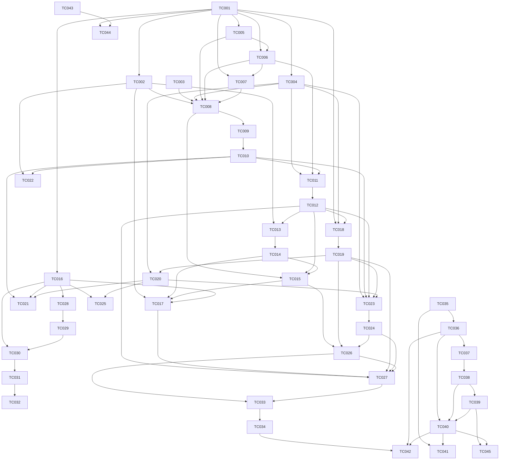

# TDD remediation task-card index

Authority: [plan.md](../plan.md), sections 1–14. Audit references only confirm finding IDs and source locations in [the original audit](../AVIATOR_DEFERRED_RISKS_GRAPHIFY_AUDIT.md). This index was written before the cards and updated last after card validation.

## Cards

| Card | Title | REM ID(s) | Priority | Complexity | Phase | Dependencies | Status |
|---|---|---|---|---|---|---|---|---|
| [TC-001](001-postgresql-integration-test-harness.md) | PostgreSQL integration test harness | REM-001 | P0 | Medium | 0 | none | BLOCKED until decision |
| [TC-002](002-atomic-round-and-commitment-creation.md) | Atomic round and commitment creation | REM-002 | P0 | Small | 1 | TC-001 | TODO |
| [TC-003](003-fail-closed-aviator-authentication.md) | Fail-closed Aviator authentication | REM-003 | P0 | Medium | 1 | none | TODO |
| [TC-004](004-round-compare-and-set-and-legal-transitions.md) | Round compare-and-set and legal transitions | REM-004 | P0 | Medium | 2 | TC-001 | DONE |
| [TC-005](005-atomic-command-sequence-allocation.md) | Atomic command sequence allocation | REM-005 | P1 | Small | 2 | TC-001 | DONE |
| [TC-006](006-deterministic-keys-and-early-claim-primitives.md) | Deterministic keys and early claim primitives | REM-006 | P0 | Medium | 2 | TC-001, TC-005 | TODO |
| [TC-007](007-account-locked-balance-enforcement.md) | Account-locked balance enforcement | REM-007 | P1 | Medium | 3 | TC-001, TC-006 | TODO |
| [TC-008](008-transactional-place-bet-command.md) | Transactional place-bet command | REM-008 | P0 | Medium | 3 | TC-002, TC-003, TC-004, TC-005, TC-006, TC-007 | TODO |
| [TC-009](009-transactional-cancellation-command.md) | Transactional cancellation command | REM-008 | P0 | Medium | 3 | TC-008 | TODO |
| [TC-010](010-transactional-cash-out-command.md) | Transactional cash-out command | REM-008 | P0 | Medium | 3 | TC-009 | TODO |
| [TC-011](011-atomic-crash-settlement.md) | Atomic crash settlement | REM-009 | P0 | Medium | 3 | TC-004, TC-006, TC-010 | TODO |
| [TC-012](012-single-crash-writer-and-resumable-follow-up.md) | Single crash writer and resumable follow-up | REM-009 | P0 | Small | 3 | TC-011 | TODO |
| [TC-013](013-fairness-secret-envelope-encryption.md) | Fairness secret envelope encryption | REM-010 | P1 | Medium | 4 | TC-002, TC-012 | BLOCKED until decision |
| [TC-014](014-fairness-secret-migration-and-key-rotation.md) | Fairness secret migration and key rotation | REM-010 | P1 | Medium | 4 | TC-013 | BLOCKED until decision |
| [TC-015](015-atomic-fairness-evidence-and-repair.md) | Atomic fairness evidence and repair | REM-011 | P1 | Medium | 4 | TC-008, TC-012, TC-014 | TODO |
| [TC-016](016-immutable-algorithm-version-registry.md) | Immutable algorithm-version registry | REM-013 | P2 | Medium | 4 | TC-001 | TODO |
| [TC-017](017-validated-commitment-reuse.md) | Validated commitment reuse | REM-012 | P2 | Small | 4 | TC-002, TC-014, TC-015, TC-016 | TODO |
| [TC-018](018-lifecycle-lease-and-active-round-constraint.md) | Lifecycle lease and active-round constraint | REM-014 | P1 | Medium | 5 | TC-001, TC-004, TC-012 | TODO |
| [TC-019](019-fenced-lifecycle-writes-and-takeover.md) | Fenced lifecycle writes and takeover | REM-014 | P1 | Medium | 5 | TC-018 | TODO |
| [TC-020](020-persisted-phase-and-flight-clock.md) | Persisted phase and flight clock | REM-015 | P1 | Medium | 5 | TC-004, TC-019 | TODO |
| [TC-021](021-versioned-elapsed-time-multiplier-curve.md) | Versioned elapsed-time multiplier curve | REM-015 | P1 | Large | 5 | TC-010, TC-016, TC-020 | BLOCKED until decision |
| [TC-022](022-server-and-client-betting-window-agreement.md) | Server and client betting-window agreement | REM-016 | P2 | Small | 5 | TC-002, TC-010 | BLOCKED until decision |
| [TC-023](023-atomic-round-state-and-event-journal.md) | Atomic round state and event journal | REM-017 | P1 | Medium | 5 | TC-004, TC-010, TC-012, TC-019, TC-020 | TODO |
| [TC-024](024-post-commit-broadcasts-and-event-repair.md) | Post-commit broadcasts and event repair | REM-017 | P1 | Medium | 5 | TC-023 | TODO |
| [TC-025](025-validated-and-persisted-lifecycle-configuration.md) | Validated and persisted lifecycle configuration | REM-018 | P2 | Small | 5 | TC-016, TC-020 | TODO |
| [TC-026](026-reusable-financial-invariant-checker.md) | Reusable financial invariant checker | REM-022 | P1 | Medium | 5 | TC-015, TC-019, TC-024 | TODO |
| [TC-027](027-durable-lifecycle-diagnostics-and-reconciliation.md) | Durable lifecycle diagnostics and reconciliation | REM-019 | P2 | Medium | 5 | TC-012, TC-017, TC-019, TC-024, TC-026 | TODO |
| [TC-028](028-independent-oracle-and-golden-vectors.md) | Independent oracle and golden vectors | REM-020 | P1 | Medium | 6 | TC-016 | TODO |
| [TC-029](029-differential-properties-and-mutation-controls.md) | Differential properties and mutation controls | REM-020 | P1 | Medium | 6 | TC-028 | TODO |
| [TC-030](030-exact-multiplier-distribution-analysis.md) | Exact multiplier distribution analysis | REM-021 | P2 | Medium | 6 | TC-016, TC-029 | TODO |
| [TC-031](031-rng-collection-and-statistical-battery.md) | RNG collection and statistical battery | REM-021 | P2 | Medium | 6 | TC-030 | TODO |
| [TC-032](032-cash-out-strategy-simulation-reports.md) | Cash-out strategy simulation reports | REM-021 | P2 | Medium | 6 | TC-031 | TODO |
| [TC-033](033-financial-failpoint-and-recovery-matrix.md) | Financial failpoint and recovery matrix | REM-022 | P1 | Medium | 6 | TC-026, TC-027 | TODO |
| [TC-034](034-randomized-financial-and-multi-owner-stress.md) | Randomized financial and multi-owner stress | REM-022 | P1 | Medium | 6 | TC-033 | TODO |
| [TC-035](035-rendered-compose-state-matrix.md) | Rendered Compose state matrix | REM-023 | P2 | Medium | 7 | none | TODO |
| [TC-036](036-compose-accessibility-and-variant-navigation.md) | Compose accessibility and variant navigation | REM-023 | P2 | Medium | 7 | TC-035 | TODO |
| [TC-037](037-structural-release-isolation-for-test-harness.md) | Structural release isolation for test harness | REM-025 | P2 | Medium | 7 | TC-036 | TODO |
| [TC-038](038-transport-faults-and-device-process-recovery.md) | Transport faults and device process recovery | REM-025 | P2 | Medium | 7 | TC-037 | TODO |
| [TC-039](039-artifact-bound-device-evidence-verifier.md) | Artifact-bound device evidence verifier | REM-025 | P2 | Medium | 7 | TC-038 | TODO |
| [TC-040](040-device-execution-and-evidence-collection.md) | Device execution and evidence collection | REM-025 | P2 | Medium | 7 | TC-036, TC-038, TC-039 | TODO |
| [TC-041](041-aviator-performance-baseline-and-thresholds.md) | Aviator performance baseline and thresholds | REM-024 | P3 | Medium | 7 | TC-035, TC-040 | TODO |
| [TC-042](042-jev-exploratory-workflows.md) | Jev exploratory workflows | REM-026 | P3 | Medium | 7 | TC-034, TC-036, TC-040 | BLOCKED until decision |
| [TC-043](043-fail-safe-pilot-prerequisite-policy.md) | Fail-safe pilot prerequisite policy | REM-027 | P2 | Small | 8 | none | TODO |
| [TC-044](044-persistent-authorized-prerequisite-register.md) | Persistent authorized prerequisite register | REM-028 | P2 | Medium | 8 | TC-001, TC-043 | TODO |
| [TC-045](045-release-verdict-consistency-gate.md) | Release verdict consistency gate | REM-029 | P3 | Small | 8 | TC-039, TC-040 | TODO |

## Dependency graph

Each line lists immediate prerequisites; arrows point from prerequisites to the card. These are PR prerequisites, not permission to deploy an incomplete phase.

## Recommended execution order

1. Phase 0 — Verification foundation: TC-001.
2. Phase 1 — Critical blockers: TC-002, TC-003.
3. Phase 2 — Persistence correctness primitives: TC-004, TC-005, TC-006.
4. Phase 3 — Money path: TC-007, TC-008, TC-009, TC-010, TC-011, TC-012.
5. Phase 4 — Fairness integrity: TC-013, TC-014, TC-015, TC-016, TC-017.
6. Phase 5 — Lifecycle ownership, timing and events: TC-018, TC-019, TC-020, TC-021, TC-022, TC-023, TC-024, TC-025, TC-026, TC-027.
7. Phase 6 — Assurance: TC-028, TC-029, TC-030, TC-031, TC-032, TC-033, TC-034.
8. Phase 7 — Android verification: TC-035, TC-036, TC-037, TC-038, TC-039, TC-040, TC-041, TC-042.
9. Phase 8 — Governance code: TC-043, TC-044, TC-045.

Plan section 9 REM order: Phase 0: 001; Phase 1: 002, 003; Phase 2: 004, 005, 006; Phase 3: 007, 008, 009 (incremental 022 tests); Phase 4: 010, 011, 012, 013; Phase 5: 014, 015, 016, 017, 018, 019; Phase 6: 020, 021, completion of 022; Phase 7: 023, 025, 024, 026; Phase 8: 027, 028, 029. Android may start from Phase 1; governance may proceed independently subject to the listed dependencies. A blocked optional curve does not block Stage A or journal work.

## Decision gates

- TC-001 / REM-001: **BLOCKED until decision.** Can CI start a disposable PostgreSQL container on every relevant change, and which PostgreSQL major version matches production?
- TC-013 / REM-010: **BLOCKED until decision.** Which FairnessKeyProvider backend (environment-provided key or external KMS) and key ID/version configuration will be used?
- TC-014 / REM-010: **BLOCKED until decision.** Which FairnessKeyProvider backend (environment-provided key or external KMS) and key ID/version configuration will be used? (Same provider decision as TC-013; no second approval required.)
- TC-021 / REM-015: **BLOCKED until decision.** Is a curve-based multiplier approved, and what immutable curve specification and rules version govern command-time cash-out and crash clamping?
- TC-022 / REM-016: **BLOCKED until decision.** Should place-bet and cancel be accepted only in BET_COUNTDOWN, or should SCHEDULED remain open with the client and lifecycle explicitly aligned?
- TC-042 / REM-026: **BLOCKED until decision.** Is Jev the adopted exploratory tool, and is its executable/service available to the CI device runner?

Table status is TODO except the explicit decision gates, where the user's special handling overrides the default TODO requirement. Dependent cards remain TODO but cannot start before their prerequisites are complete. REM-010 migration carries the same blocked provider gate as TC-013; one recorded choice unblocks both.

Before relevant implementation/deployment, record the behavior confirmations requested by plan sections 1 and 11 for registry/startup enforcement and Stage A deadline correction. TC-032 needs the team's strategy set and TC-041 needs agreed device targets/thresholds before freezing acceptance fixtures. These are scoped acceptance inputs, not additional remediation findings.

## Global TDD rules

1. After read-only Step 0 and prerequisites, the first implementation work is failing tests, in each card's numbered order: RED, GREEN, then REFACTOR.
2. RED counts only for the stated defect or missing capability. Record expected versus actual failure. Unrelated compilation/environment failures do not prove a bug; Android's specifically missing Compose dependency is a permitted infrastructure RED. Existing passing controls stay passing; never manufacture a defect to claim RED.
3. Make only the minimal change that turns each test green. Refactor only when green.
4. Bug fixes start with a reproduction on current code, citing the audit section. If a prerequisite already fixes it, retain it as a regression and use the remaining scoped gap as RED; report the distinction.
5. Money, ledger, wager, settlement, fairness, lifecycle and event-store tests use real PostgreSQL through TC-001 with migrations and production adapters. Fakes are for pure logic only and must enforce the production constraints represented.
6. Preserve floor(wager minor units × multiplier), minor units, ledger accounts, double-entry mathematics and the 1.0.0 outcome formula. Relevant cards include guard vectors. Stage B requires its explicit decision and a new bound curve; it cannot silently replace 1.0.0.
7. Never edit an applied migration. Re-discover the next available Flyway version. Begin with a read-only conflicting-data query; abort with identified rows and a diagnostic. Never auto-delete money rows. New schema/table names in cards are proposals.
8. One card is one reviewable PR. Prefer a tests-only red commit followed by a green commit using the card's suggested message. No explanatory source comments/docstrings may be added or changed.
9. Global lock order: **receipt → round → bet → player account → sequence counter**. Commands take the round shared; lifecycle takes it exclusively. Crash omits absent receipt/player locks, locks bets in deterministic ID order, and never reverses the order. Sequence counters are allocated last. Each money-path card tests lock acquisition order or races mixed operations.
10. Fast tests, PostgreSQL, fast failpoints and Compose execute on PRs; full failpoints, seeded stress, differential/mutation, statistics and benchmarks execute nightly. Missing required DB/device fails rather than skips. Use disposable data, redact secrets, preserve tenant isolation.

## Definition of done

- [ ] Every card's numbered tests were run; each claimed RED failed for its stated reason before GREEN.
- [ ] Acceptance criteria map to passing tests and artifacts; touched modules' complete existing suites pass.
- [ ] PostgreSQL tests use real migrations and joining transactions; I1–I12 hold for completed flows.
- [ ] Migrations apply on empty and representative copied data after diagnostic pre-checks; migration N/A is recorded when no schema changes occur.
- [ ] No unrelated files or monetary formulas changed; one reviewable PR and clear red/green history.
- [ ] Relevant evidence records commit, configuration/version, seeds and artifact digests; no false certification claims.
- [ ] The card and this index have matching status, and all dependencies are complete.
- [ ] Plan section 14 completion criteria are demonstrated; section 13 policy and external certification remain excluded.

## Dependency interpretations and verification limits

- REM-006/007/008 form a transaction cycle in section 6. TC-006 and TC-007 build and test primitives inside a real caller transaction; TC-008 activates them atomically for place-bet, then TC-009/010 activate terminal commands. Do not deploy intermediate primitives as a completed money-path fix.
- REM-008/011 and REM-010/011 are also cyclic. TC-008 makes first-bet fairness writes join the command transaction as the required AV-AUD-003 prerequisite. TC-013/014 establish secret handling; TC-015 completes independent publication/reveal CAS and legacy repair. REM-011's later completion is not a forward dependency.
- REM-012 explicitly requires REM-013 despite section 9 listing 012 first: TC-016 precedes TC-017.
- REM-019 requires the REM-022 checker although section 9 finishes 022 later: TC-026 extracts the checker before TC-027; TC-033/034 finish assurance.
- REM-006's early receipt and late sequence conflict with V28 mandatory final fields. TC-006 proposes transaction-private pending fields with completion enforcement, contingent on Step 0 schema verification; no incomplete receipt may commit and no placeholder counter is allocated.
- REM-003 says all Aviator endpoints, while some controller routes look public. TC-003 applies the plan's all-endpoints rule and records the exact route inventory; relaxing it requires clarification, not a silent exception.
- REM-017's I9 is about lifecycle round versions. REM-004 must resolve command version semantics before journal identity is chosen; no uniqueness index may discard legitimate command events.
- REM-020's global monotonicity claim conflicts with modulus-33 instant crashes. Test monotonicity on the non-instant-crash branch and test multiples of 33 separately; surface any specification disagreement without changing 1.0.0.
- I3 concerns terminal settlement ledger transactions, not reservation/funding entries; I6 means accepted financial effects correspond to completed accepted receipts, while rejected receipts must have zero financial effects. Record these scopes in TC-026.
- Stage B cannot specify numeric curve expectations until the decision supplies the curve. TC-021 defines decision-bound golden fixtures, with no invented formula.
- Read-only inspection found existing Testcontainers 1.20.1/JUnit5 and a PostgreSQL 16 CI service. The current migration test allows Docker skips; production major version and CI capability remain decision inputs. Migrations currently include V38; never reserve a version now.
- V28 already has receipt fingerprint and unique settlement-per-bet, and requires receipt sequence/result fields. TC-006 verifies reuse and a valid uncommitted claim representation rather than blindly adding duplicate columns. V30 lacks a round-version column; TC-023 verifies a backfill before indexing.
- `core/testing` is a Kotlin/JVM module; use `:core:testing:test`, not an Android variant task. Android instrumentation commands are derived from inspected flavors and must be confirmed with Gradle tasks before implementation.
- Existing device verifier already hashes the APK. TC-039 preserves this passing guard and targets per-evidence hashes, placeholders and commit binding. Existing Android benchmark module is inspected/reused where appropriate.
- Both repositories' local Graphify preflight/query succeeded; Android required `./.conda/bin/python -m graphify` because the executable launcher failed. Existing unrelated dirty files were left alone. No graph update is permitted during this read-only task; source drift is rechecked in Step 0. Existing Gradle 8.7 daemons were idle/running; no builds or test suites were executed during planning.

## Created-file manifest and final self-check

Validation completed: **45 task cards + 1 index; all 29 REM items covered**.

- [x] Numbers 001–045 contiguous, no gaps or duplicates.
- [x] All 13 exact template headings present in every card.
- [x] Every card has named Given/When/Then tests with layer, location, setup, action, concrete assertions and expected current-code failure.
- [x] All dependency edges point backward; Blocks fields are reciprocal.
- [x] Gated status and questions recorded; remaining cards TODO.
- [x] Plan section 13 generated no task cards.
- [x] Only files in planning-testing/tcs/ were written. Existing dirty file lists in slotting and slotting_admin match the initial inspection; no source/test/migration/configuration/data edits or builds were performed.
- [x] Repository-local Graphify queries and scoped read-only inspections completed. Planning validation used a read-only Node check; implementation test execution is intentionally deferred.

Created files (all relative to planning-testing/tcs/):

- [000-INDEX.md](000-INDEX.md)
- [001-postgresql-integration-test-harness.md](001-postgresql-integration-test-harness.md)
- [002-atomic-round-and-commitment-creation.md](002-atomic-round-and-commitment-creation.md)
- [003-fail-closed-aviator-authentication.md](003-fail-closed-aviator-authentication.md)
- [004-round-compare-and-set-and-legal-transitions.md](004-round-compare-and-set-and-legal-transitions.md)
- [005-atomic-command-sequence-allocation.md](005-atomic-command-sequence-allocation.md)
- [006-deterministic-keys-and-early-claim-primitives.md](006-deterministic-keys-and-early-claim-primitives.md)
- [007-account-locked-balance-enforcement.md](007-account-locked-balance-enforcement.md)
- [008-transactional-place-bet-command.md](008-transactional-place-bet-command.md)
- [009-transactional-cancellation-command.md](009-transactional-cancellation-command.md)
- [010-transactional-cash-out-command.md](010-transactional-cash-out-command.md)
- [011-atomic-crash-settlement.md](011-atomic-crash-settlement.md)
- [012-single-crash-writer-and-resumable-follow-up.md](012-single-crash-writer-and-resumable-follow-up.md)
- [013-fairness-secret-envelope-encryption.md](013-fairness-secret-envelope-encryption.md)
- [014-fairness-secret-migration-and-key-rotation.md](014-fairness-secret-migration-and-key-rotation.md)
- [015-atomic-fairness-evidence-and-repair.md](015-atomic-fairness-evidence-and-repair.md)
- [016-immutable-algorithm-version-registry.md](016-immutable-algorithm-version-registry.md)
- [017-validated-commitment-reuse.md](017-validated-commitment-reuse.md)
- [018-lifecycle-lease-and-active-round-constraint.md](018-lifecycle-lease-and-active-round-constraint.md)
- [019-fenced-lifecycle-writes-and-takeover.md](019-fenced-lifecycle-writes-and-takeover.md)
- [020-persisted-phase-and-flight-clock.md](020-persisted-phase-and-flight-clock.md)
- [021-versioned-elapsed-time-multiplier-curve.md](021-versioned-elapsed-time-multiplier-curve.md)
- [022-server-and-client-betting-window-agreement.md](022-server-and-client-betting-window-agreement.md)
- [023-atomic-round-state-and-event-journal.md](023-atomic-round-state-and-event-journal.md)
- [024-post-commit-broadcasts-and-event-repair.md](024-post-commit-broadcasts-and-event-repair.md)
- [025-validated-and-persisted-lifecycle-configuration.md](025-validated-and-persisted-lifecycle-configuration.md)
- [026-reusable-financial-invariant-checker.md](026-reusable-financial-invariant-checker.md)
- [027-durable-lifecycle-diagnostics-and-reconciliation.md](027-durable-lifecycle-diagnostics-and-reconciliation.md)
- [028-independent-oracle-and-golden-vectors.md](028-independent-oracle-and-golden-vectors.md)
- [029-differential-properties-and-mutation-controls.md](029-differential-properties-and-mutation-controls.md)
- [030-exact-multiplier-distribution-analysis.md](030-exact-multiplier-distribution-analysis.md)
- [031-rng-collection-and-statistical-battery.md](031-rng-collection-and-statistical-battery.md)
- [032-cash-out-strategy-simulation-reports.md](032-cash-out-strategy-simulation-reports.md)
- [033-financial-failpoint-and-recovery-matrix.md](033-financial-failpoint-and-recovery-matrix.md)
- [034-randomized-financial-and-multi-owner-stress.md](034-randomized-financial-and-multi-owner-stress.md)
- [035-rendered-compose-state-matrix.md](035-rendered-compose-state-matrix.md)
- [036-compose-accessibility-and-variant-navigation.md](036-compose-accessibility-and-variant-navigation.md)
- [037-structural-release-isolation-for-test-harness.md](037-structural-release-isolation-for-test-harness.md)
- [038-transport-faults-and-device-process-recovery.md](038-transport-faults-and-device-process-recovery.md)
- [039-artifact-bound-device-evidence-verifier.md](039-artifact-bound-device-evidence-verifier.md)
- [040-device-execution-and-evidence-collection.md](040-device-execution-and-evidence-collection.md)
- [041-aviator-performance-baseline-and-thresholds.md](041-aviator-performance-baseline-and-thresholds.md)
- [042-jev-exploratory-workflows.md](042-jev-exploratory-workflows.md)
- [043-fail-safe-pilot-prerequisite-policy.md](043-fail-safe-pilot-prerequisite-policy.md)
- [044-persistent-authorized-prerequisite-register.md](044-persistent-authorized-prerequisite-register.md)
- [045-release-verdict-consistency-gate.md](045-release-verdict-consistency-gate.md)
