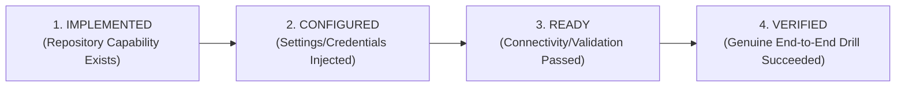
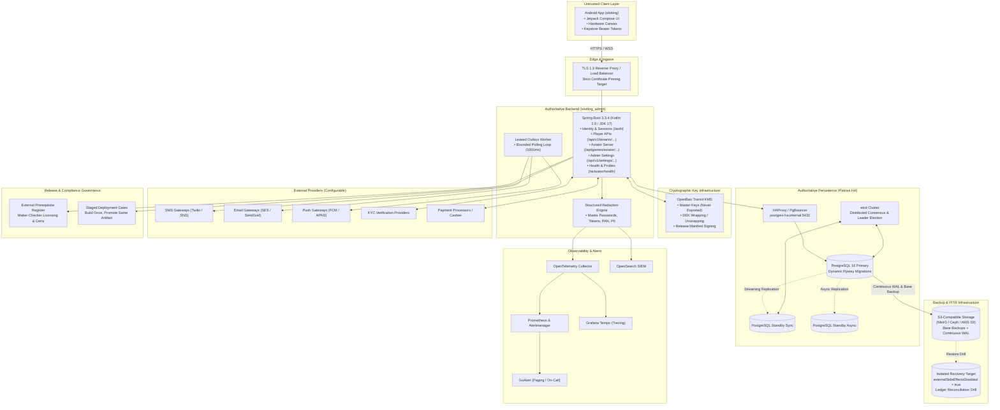
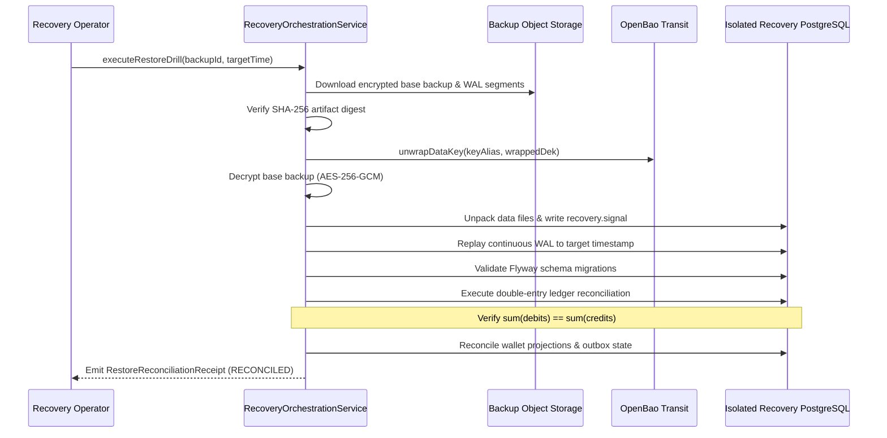
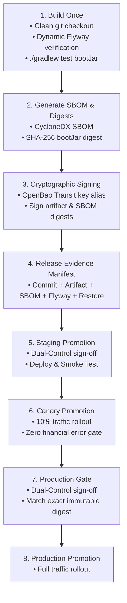

# Slotting Administrator Authority & Backend Operations Guide

> **Canonical System Setup, Infrastructure, Security, Administration, Operations, and Production-Readiness Guide**  
> **Repository:** `slotting_admin` | **Companion Client:** `slotting` (Android)

---

## 1. Documentation Ownership & Scope

This document is the **authoritative master setup, infrastructure, operations, security, administration, deployment, compliance-configuration, backup/recovery, observability, CI/CD, and production-readiness guide** for the Slotting platform.

- **`slotting_admin` (This Repository):** Owns all server-side policies, administrative RBAC, double-entry financial ledgers, cryptographic key management, disaster recovery verification, privacy compliance, provider integrations, and release promotion gates.
- **`slotting` (Android Repository):** Client-side application guide located at [`../slotting/README.md`](../slotting/README.md). Covers Android build variants, client-to-backend transport configuration, SPKI pinning, APK/AAB release signing, R8 keep rules, device evidence, and accessibility/security testing.

---

## 2. Four Operational Readiness Levels

Throughout this guide and across all system tooling, readiness is strictly evaluated across four explicit levels. Operational capability must **never** be assumed merely because code exists in the repository.



| Maturity Level | Definition | Concrete System Example |
|---|---|---|
| **`IMPLEMENTED`** | Domain models, storage interfaces, adapters, and contract test suites exist in the checkout. | `BackupStorageConfig` and S3 client adapters are compiled. |
| **`CONFIGURED`** | Required administrative endpoints, provider credentials, or deployment parameters have been supplied. | Storage endpoint `https://s3.internal.example.invalid:9000` and credentials saved. |
| **`READY`** | Active validation probes succeed against live external infrastructure (e.g. bucket ping, TLS handshake). | Bucket exists, write/read test probe passes, status transitions to `StorageReadiness.READY`. |
| **`VERIFIED`** | A genuine end-to-end operation has succeeded under realistic conditions with verified receipts. | An isolated database restore replayed continuous WAL and reconciled `sum(debits) == sum(credits)`. |

> [!IMPORTANT]
> - `BackupStorageAdapter implemented` does not mean `backup storage configured`.
> - `backup storage configured` does not mean `recovery verified`.
> - `Technical gate passing` does not mean `pilot or production legally authorized`.

---

## 3. High-Level System Architecture



---

## 4. Subsystem Implementation & Readiness Status

| Subsystem | Architectural Role | Repository Status | Production Infrastructure Requirement |
|---|---|---|---|
| **Identity & Sessions** | PKCE OAuth2, refresh token rotation, step-up MFA | `IMPLEMENTED` | PostgreSQL 16 (`V19__durable_auth_sessions.sql`) |
| **Double-Entry Ledger** | Immutable debits/credits, multi-currency balance assertions | `IMPLEMENTED` | PostgreSQL 16 (`V21__persistent_double_entry_ledger.sql`) |
| **Aviator Game Engine** | Provably fair seeds, multiplier curve, authoritative cashout | `IMPLEMENTED` | In-process Spring service + WebSocket controllers |

### Aviator round lifecycle

`AviatorRoundLifecycleOrchestrator` is the single in-process owner that connects the existing round store, fairness authority, crash settlement, and authoritative event journal. It advances `SCHEDULED -> BET_COUNTDOWN -> FLYING -> CRASHED -> CLOSED`, recovers the latest persisted round, and never uses a connected client to drive domain state.

The scheduler is controlled by `slotting.aviator.lifecycle.*`. Its checked-in timing fallbacks (`scheduled-ms`, `betting-ms`, `closed-ms`, `tick-ms`, and `multiplier-step`) are development defaults, not approved production game rules. `tenants` defaults to `default`; set `enabled=false` to disable the lifecycle owner. Current ownership is intentionally single-application-instance only; clustered leader election remains future work.

Run its deterministic fake-clock tests with:

```bash
./gradlew test --tests com.slotting.admin.gameprovider.AviatorRoundLifecycleOrchestratorTest
```
| **Admin RBAC** | Least privilege, separation of duties, break-glass auto-expiry | `IMPLEMENTED` | PostgreSQL 16 (`V2__admin_rbac.sql`) |
| **Dual-Control Gate** | Two-person rule for financial, release, and security changes | `IMPLEMENTED` | PostgreSQL 16 (`V20__dual_control_approvals.sql`) |
| **Secret Encryption** | AES-256-GCM envelope encryption with AAD context binding | `IMPLEMENTED` | OpenBao Transit or external KMS master key |
| **PostgreSQL HA** | Leader election, automatic failover, sync replication | `IMPLEMENTED` | Patroni + etcd + HAProxy cluster |
| **Backup Storage** | S3-compatible base backup + continuous WAL archival | `IMPLEMENTED` | S3-compatible Object Storage (MinIO / Ceph / S3) |
| **Recovery Drill** | Isolated database restore, WAL replay, ledger reconciliation | `IMPLEMENTED` | Ephemeral isolated PostgreSQL recovery target |
| **Truthful Notifications** | Bounded outbox, delivery callback confirmation, suppression | `IMPLEMENTED` | External SMS/Email/Push provider accounts |
| **Observability & SIEM** | Structured redaction, metric export, alert routing rules | `IMPLEMENTED` | OpenSearch + Prometheus + Alertmanager |
| **Privacy & DSAR** | Configurable retention engine, legal holds, per-store purge | `IMPLEMENTED` | Admin policy configuration (no hardcoded durations) |
| **Backend CI/CD** | Dynamic Flyway discovery, CycloneDX SBOM, OpenBao signing | `IMPLEMENTED` | GitHub Actions runner + Harbor registry |
| **External Prerequisite Register**| Auditable tracking of licenses, merchant certs, lab audits | `IMPLEMENTED` | Administrative Maker-Checker configuration |
| **Device Attestation Plugin** | Google Play Integrity / hardware attestation adapter | `Planned / Plugin`| External Cloud service account (Optional) |

---

## 5. Prerequisites & Environment Setup

### 5.1 Local Development Requirements
- **JDK:** OpenJDK 17 LTS (`kotlin.jvmToolchain(17)`).
- **Gradle:** 8.x (wrapper provided: `./gradlew`).
- **PostgreSQL:** 16+ (local service or Docker).
- **Docker:** Required for running ephemeral Testcontainers suites.
- **Python:** 3.10+ (used for repository Graphify query scripts and tooling).

### 5.2 Production Infrastructure Requirements
- **PostgreSQL HA:** PostgreSQL 16 managed by **Patroni** with an **etcd** DCS quorum (minimum 3 nodes) fronted by **HAProxy** or **PgBouncer**.
- **KMS / Signing Authority:** **OpenBao Transit** (preferred self-hosted) or AWS KMS / HashiCorp Vault.
- **Object Storage:** S3-compliant object store supporting Object Lock / WORM immutability (MinIO, Ceph, AWS S3, or GCS).
- **Container Registry:** **Harbor** (preferred self-hosted OCI registry) or GHCR, ECR, GCP Artifact Registry.
- **Observability Stack:** **OpenSearch** (SIEM), **OpenTelemetry Collector**, **Prometheus & Alertmanager**, **Grafana Tempo**, and **GoAlert**.

### 5.3 Preferred Open-Source / Self-Hosted Stack

| Function | Preferred Open-Source Default | Production Role |
|---|---|---|
| **Database** | [PostgreSQL 16](https://www.postgresql.org/) | Authoritative persistent double-entry ledger & state |
| **Database HA** | [Patroni](https://github.com/patroni/patroni) | Automated failover, standby synchronization, REST status |
| **Consensus Engine** | [etcd v3](https://etcd.io/) | Distributed configuration store & leader leases |
| **Database Routing** | [HAProxy](http://www.haproxy.org/) | Stable primary endpoint routing (`postgres-ha.internal:5432`) |
| **Key Management** | [OpenBao Transit](https://openbao.org/) | Master key isolation, DEK envelope encryption, artifact signing |
| **Object Storage** | [MinIO](https://min.io/) or [Ceph](https://ceph.io/) | S3-compatible immutable backup artifacts & WAL segments |
| **Container Registry**| [Harbor](https://goharbor.io/) | OCI registry, vulnerability scanning, Cosign/OpenBao verification |
| **Security SIEM** | [OpenSearch](https://opensearch.org/) | Searchable audit trail, authentication logs, security events |
| **Telemetry Pipeline**| [OpenTelemetry Collector](https://opentelemetry.io/) | Ingestion, trace/metric aggregation, outbound routing |
| **Metrics** | [Prometheus](https://prometheus.io/) | Time-series operational metrics, scrape targets |
| **Distributed Traces**| [Grafana Tempo](https://grafana.com/oss/tempo/) | OTLP trace backend, span sampling, latency inspection |
| **Dashboards** | [Grafana OSS](https://grafana.com/oss/grafana/) | Centralized operational, financial, and security dashboards |
| **Alert Routing** | [Alertmanager](https://prometheus.io/docs/alerting/latest/alertmanager/) | Deduplication, grouping, severity dispatch |
| **On-Call Escalation**| [GoAlert](https://goalert.me/) | Rotations, schedules, SMS/voice paging |
| **Error Tracking** | [GlitchTip](https://glitchtip.com/) | Exception reporting, Sentry-compatible crash telemetry |

---

## 6. Local Development Quick Start

Follow this verified step-by-step procedure to bootstrap the backend locally:

### 1. Configure Local Database
Set the required environment variables pointing to a running PostgreSQL 16 instance:

```bash
export SLOTTING_ADMIN_DATABASE_URL="jdbc:postgresql://localhost:5432/slotting_admin"
export SLOTTING_ADMIN_DATABASE_USERNAME="postgres"
export SLOTTING_ADMIN_DATABASE_PASSWORD="local_dev_password"
```

### 2. Verify and Run Test Suite
Run the unit and contract test suites. Ephemeral Testcontainers will automatically spin up isolated PostgreSQL containers for integration tests:

```bash
# Execute full backend test suite
./gradlew test

# Execute PostgreSQL migration & schema verification specifically
./gradlew test --tests "com.slotting.admin.infra.PostgresMigrationIntegrationTest"

# Execute Authoritative Pilot Evidence Gate contract tests (TC-044)
./gradlew test --tests "com.slotting.admin.validation.pack.AuthoritativePilotEvidenceGateContractTest"
```

### 3. Start the Backend Service
Launch the Spring Boot application on port `8080`:

```bash
./gradlew bootRun
```

### 4. Verify Health & Readiness Probes
Confirm all readiness indicators report `UP`:

```bash
curl -s http://localhost:8080/actuator/health/readiness | jq .
```

*Expected output:*
```json
{
  "status": "UP",
  "components": {
    "db": { "status": "UP" },
    "identityReadiness": { "status": "UP", "details": { "identity": "ready" } },
    "ledgerReadiness": { "status": "UP", "details": { "ledger": "ready" } },
    "providerReadiness": { "status": "UP", "details": { "provider": "ready" } },
    "kmsReadiness": { "status": "UP", "details": { "kms": "ready" } },
    "workerReadiness": { "status": "UP", "details": { "worker": "ready" } },
    "policyReadiness": { "status": "UP", "details": { "policy": "ready" } },
    "schemaMigration": { "status": "UP", "details": { "schemaVersion": "37" } }
  }
}
```

### 5. Connecting the Android Client (`slotting`)
The Android application connects to `slotting_admin` for player sessions, wallet balances, cashouts, and crash telemetry:
- **Android Emulator Loopback:** Use `http://10.0.2.2:8080` (or `https://10.0.2.2:8443` if TLS is enabled).
- **Physical Test Device:** Use the host machine's LAN IP address (e.g. `https://192.168.1.50:8443`).
- For complete Android build, SPKI pinning, and variant instructions, see [`../slotting/README.md`](../slotting/README.md).

---

## 7. Configuration Philosophy & Ownership Matrix

### 7.1 The Golden Rule of Configuration
> **Deployment-specific credentials, endpoints, policy values, retention durations, operational targets, and provider settings must NOT be hard-coded.**  
> Code implements the policy engine; authorized administrators and deployment pipelines configure the actual policies and credentials.

### 7.2 Configuration Ownership Matrix

| Configuration Item | Configured By | Storage / Trust Boundary | Lifecycle & Sensitivity |
|---|---|---|---|
| **Database Bootstrap Credentials** | DevOps / Infrastructure | Deployment Environment (`SLOTTING_ADMIN_DATABASE_*`) | Injected at container launch; never in DB |
| **OpenBao Transit Bootstrap Token** | DevOps / Infrastructure | Deployment Environment (`OPENBAO_TOKEN`) | Master root-of-trust; never stored in settings |
| **SMS Provider Credentials** | Super Admin (`AdminRole.SUPER_ADMIN`) | Encrypted Integration Settings Table | Write-only via Admin API; AES-256-GCM encrypted |
| **Email Provider Credentials** | Super Admin (`AdminRole.SUPER_ADMIN`) | Encrypted Integration Settings Table | Write-only via Admin API; AES-256-GCM encrypted |
| **Push Provider Credentials** | Super Admin (`AdminRole.SUPER_ADMIN`) | Encrypted Integration Settings Table | Write-only via Admin API; AES-256-GCM encrypted |
| **SIEM / Logging API Token** | Security Admin (`AdminRole.SECURITY`) | Encrypted Observability Settings Table | Write-only via Admin API; never returned to UI |
| **Paging Webhook URL** | Security Admin (`AdminRole.SECURITY`) | Encrypted Observability Settings Table | Write-only via Admin API; validated on update |
| **Backup Storage S3 Credentials** | Infrastructure Admin (`AdminRole.SUPER_ADMIN`) | Encrypted Backup Storage Config Table | Write-only; rotatable without application restart |
| **RPO / RTO Operational Targets**| Operations Admin (`AdminRole.SUPER_ADMIN`) | Recovery Objectives Table | Dynamic operational targets; audited on change |
| **Privacy Retention Durations** | Compliance Admin (`AdminRole.AUDITOR`) | Versioned Retention Policy Table | Managed through Admin API; dual-control approved |
| **Legal Holds** | Compliance Admin (`AdminRole.AUDITOR`) | Scoped Legal Hold Table | Enforced across all stores until released |
| **Container Registry Credentials**| Release Operator | Encrypted Registry Config Table | Write-only token for container deployments |
| **Artifact Signing Private Key** | Security Officer | Stored inside OpenBao Transit Engine | **Never leaves OpenBao**; app only holds key alias |
| **Android Release Signing Key** | CI/CD Infrastructure | External CI Secret Store (`RELEASE_KEYSTORE_*`) | Root-of-trust secret; strictly outside backend |
| **Android SPKI Certificate Pins**| Release Engineering | Variant Transport Configuration (`VariantTransportConfig`)| Embedded in client artifact at build time |
| **External Prerequisite Evidence**| Governance Admin / Auditor | External Prerequisite Register | Maker-Checker enforced; auditable verification |

---

## 8. Admin Settings Architecture & RBAC Permissions

Admin Settings endpoints manage infrastructure, integrations, observability, recovery, and compliance without code modifications.

### 8.1 Required Administrative Permissions

| Administrative Area | Service & Models | Required Role / Permission | Dual Control Required? |
|---|---|---|---|
| **Integrations (SMS/Email/Push)**| [`IntegrationSettingsService`](src/main/kotlin/com/slotting/admin/settings/IntegrationSettingsService.kt) | `AdminPermission.SYSTEM_CONFIGURATION` | No |
| **Observability (SIEM/Paging)** | [`ObservabilitySettingsService`](src/main/kotlin/com/slotting/admin/observability/ObservabilitySettingsService.kt) | `AdminPermission.SYSTEM_CONFIGURATION` | No |
| **Backup & Recovery Storage** | [`RecoveryOrchestrationService`](src/main/kotlin/com/slotting/admin/recovery/RecoveryOrchestrationService.kt) | `AdminPermission.SYSTEM_CONFIGURATION` | No |
| **Recovery Objectives (RPO/RTO)**| [`RecoveryOrchestrationService`](src/main/kotlin/com/slotting/admin/recovery/RecoveryOrchestrationService.kt) | `AdminPermission.SYSTEM_CONFIGURATION` | Yes (Dual Control) |
| **Database Failover / Failback** | [`PatroniHaOrchestrator`](src/main/kotlin/com/slotting/admin/recovery/PatroniHaOrchestrator.kt) | `AdminPermission.EXECUTE_DATABASE_FAILOVER` | Yes (Dual Control) |
| **Privacy Policies (Approval)** | [`ComplianceGovernanceService`](src/main/kotlin/com/slotting/admin/privacy/ComplianceGovernanceService.kt) | `AdminPermission.APPROVE_PRIVACY_POLICY` | Yes (Dual Control) |
| **Legal Holds** | [`ComplianceGovernanceService`](src/main/kotlin/com/slotting/admin/privacy/ComplianceGovernanceService.kt) | `AdminPermission.SYSTEM_CONFIGURATION` | Yes (Dual Control) |
| **External Prerequisites** | [`AuthoritativePilotEvidenceGateService`](src/main/kotlin/com/slotting/admin/validation/pack/AuthoritativePilotEvidenceGateService.kt) | `AdminRole.AUDITOR` / `AdminRole.SUPER_ADMIN` | Yes (Maker-Checker) |
| **Release Promotion** | [`StagedDeploymentGateService`](src/main/kotlin/com/slotting/admin/release/StagedDeploymentGateService.kt) | `AdminPermission.PROMOTE_RELEASE` | Yes (Dual Control) |

> [!CAUTION]
> **The Inviolable Financial Invariant:**  
> `AdminPermission.FINANCIAL_MUTATION` does not exist in any role. Administrators cannot fabricate balances, mint credits, or overwrite ledger rows. Financial corrections must always be recorded as compensating journal entries through standard deposit, wager, or payout workflows.

---

## 9. Write-Only Secrets Management

All application-level secrets (API tokens, webhook secrets, S3 credentials) enforce strict write-only semantics via [`IntegrationSettingsService`](src/main/kotlin/com/slotting/admin/settings/IntegrationSettingsService.kt#L10) and [`ObservabilitySettingsService`](src/main/kotlin/com/slotting/admin/observability/ObservabilitySettingsService.kt#L10):

### Secret Mutation Rules
1. **Omitted Secret:** When updating configuration, leaving a secret field `null` retains the existing encrypted secret without modification.
2. **Replacement:** Supplying a new string encrypts the new secret using AES-256-GCM, increments the key version, and records `lastRotatedAt = Instant.now()`.
3. **Explicit Clear:** Supplying `clearAuthToken: true` or `clearApiKey: true` securely purges the stored secret payload.
4. **Zero Echoing:** Read queries return [`SecretStatusInfo(configured=true, keyVersion=1, lastRotatedAt=...)`](src/main/kotlin/com/slotting/admin/settings/IntegrationSettingsModels.kt#L52). Ciphertext, plaintext, and masked dummy strings (e.g. `********`) are **never** returned over the network.

---

## 10. Cryptographic Key Management & OpenBao Transit

### 10.1 Authenticated AES-256-GCM Envelope Encryption
All application-level secrets are encrypted using [`AesGcmEnvelopeEncryptor`](src/main/kotlin/com/slotting/admin/secret/AesGcmEnvelopeEncryption.kt#L53):
- **IV / Nonce:** 96-bit (12-byte) cryptographically secure random bytes generated uniquely per encryption. Nonce reuse is mathematically prevented.
- **Authentication Tag:** 128-bit authentication tag ensuring ciphertext integrity.
- **Associated Authenticated Data (AAD):** Bound to tenant ID, purpose context, key version, and format version:  
  `AAD:TENANT={tenantId}|CTX={context}|KVER={keyVersion}|FVER={formatVersion}`.  
  Any attempt to copy ciphertext to a different tenant, context, or key version causes an immediate `DecryptionTamperException`.

### 10.2 OpenBao Transit Integration
In production, [`OpenBaoTransitProvider`](src/main/kotlin/com/slotting/admin/recovery/OpenBaoTransitEncryptionProvider.kt#L32) acts as the key-management authority:
1. **Master Key Protection:** Master keys remain strictly inside the OpenBao Transit engine.
2. **Envelope Flow:**
   ```text
   Application generates random 256-bit DEK
          ↓
   OpenBao Transit wraps DEK with master key (key alias: "backup-master-key")
          ↓
   Application encrypts payload with DEK using AES-256-GCM
          ↓
   Plaintext DEK zeroed from memory
          ↓
   Encrypted payload stored alongside wrapped DEK and key version metadata
   ```
3. **Fail-Closed on Unavailability:** If OpenBao is sealed, unauthenticated, or unreachable, key generation and unwrapping immediately fail. Production will **never** fall back to local test keys or plaintext.

---

## 11. Notification Integrations & Delivery Semantics

### 11.1 Supported Adapters
Configured via [`IntegrationSettingsService`](src/main/kotlin/com/slotting/admin/settings/IntegrationSettingsService.kt):
- **SMS (`SmsProviderType`):** `TWILIO`, `AWS_SNS`, `CUSTOM_HTTP`.
- **Email (`EmailProviderType`):** `AWS_SES`, `SENDGRID`, `SMTP`, `CUSTOM_HTTP`.
- **Push (`PushProviderType`):** `FCM`, `APNS`, `CUSTOM_HTTP`.

### 11.2 Truthful Delivery States
The notification engine ([`TruthfulNotificationModels.kt`](src/main/kotlin/com/slotting/admin/notification/TruthfulNotificationModels.kt#L92)) rejects optimistic reporting:
- `SUBMITTED`: Notification queued in persistent outbox.
- `ACCEPTED`: External gateway acknowledged receipt of dispatch. **`ACCEPTED` DOES NOT EQUAL `DELIVERED`!**
- `DELIVERED`: Confirmed only upon receipt of a verified cryptographic callback receipt from the provider.
- `FAILED`: Gateway permanently rejected or delivery timed out.
- `SUPPRESSED`: Dispatch blocked due to player self-exclusion, cooling-off, or marketing opt-out.

### 11.3 Outbox Worker & DLQ
- A leased worker polls the database outbox every 1000ms (`slotting.outbox.worker.fixed-delay-ms: 1000`).
- Exponential backoff retry limits prevent gateway flooding.
- Exceeded retries move notifications to the Dead Letter Queue (`DLQ`) for operator investigation. Duplicate callback receipts are deduplicated idempotently.

---

## 12. Observability, Telemetry & Structured Redaction

### 12.1 Supported Sinks
Configured via [`ObservabilitySettingsService`](src/main/kotlin/com/slotting/admin/observability/ObservabilitySettingsService.kt#L10):
- **SIEM (`SiemProviderType`):** `OPENSEARCH`, `SPLUNK`, `ELASTICSEARCH`, `DATADOG`, `GENERIC_HTTPS`.
- **Paging (`PagingProviderType`):** `GOALERT`, `ALERTMANAGER`, `PAGERDUTY`, `GENERIC_WEBHOOK`.
- **Metrics (`MetricsProviderType`):** `OTEL_COLLECTOR`, `PROMETHEUS_REMOTE_WRITE`, `DATADOG`, `GENERIC_OTLP`.
- **Tracing (`TracingProviderType`):** `TEMPO`, `OTEL_COLLECTOR`, `JAEGER`, `GENERIC_OTLP`.

### 12.2 Mandatory Pre-Export Redaction
All logs, metrics, traces, and SIEM events pass through [`StructuredRedactionEngine`](src/main/kotlin/com/slotting/admin/observability/StructuredRedactionEngine.kt#L5) before leaving the process boundary:
- **Sensitive Keys Stripped:** Any field containing `password`, `secret`, `token`, `authorization`, `api_key`, `cvv`, `pan`, `pin`, `jwt`, `cookie`, `session_token`.
- **Regex Patterns Masked:** Primary Account Numbers (PANs), Social Security Numbers (SSNs), email addresses, and Bearer tokens.
- **Fail-Safe:** External observability vendors must never be relied upon as the primary data scrubbing boundary.

### 12.3 Android Crash Telemetry Routing
```text
Android Client (slotting)
       ↓ HTTPS (POST /api/v1/telemetry/crash)
slotting_admin Telemetry Controller
       ↓
Structured Redaction Engine (Masks Device PII / Tokens)
       ↓
Durable Observability Pipeline (Prometheus / Tempo / OpenSearch / GlitchTip)
```
> [!NOTE]
> Observability and SIEM credentials must **never** be placed inside the Android client application.

---

## 13. Privacy, Retention & DSAR Governance

### 13.1 The Governance Principle
> **The application provides a policy engine. Authorized administrators provide the actual policy.**  
> `slotting_admin` contains **zero** hard-coded statutory retention periods or legal assumptions (e.g. "5 years", "7 years", "GDPR", "AML"). All retention rules are configured, versioned, and activated by compliance officers.

### 13.2 Data Categories
[`DataCategory`](src/main/kotlin/com/slotting/admin/privacy/PersonalDataInventoryService.kt#L34) spans 24 distinct domains: `IDENTITY`, `PAYMENT`, `FINANCIAL_LEDGER`, `GAMING_ACTIVITY`, `KYC_DOCUMENTS`, `FRAUD_EVENTS`, `ADMINISTRATIVE_BANS`, `RESPONSIBLE_GAMING_RECORDS`, `SUPPORT_CASES`, `AUDIT_EVENTS`, `OPERATIONAL_TELEMETRY`, etc.

### 13.3 Versioned Retention Policies
Admins define policies ([`RetentionPolicyConfig`](src/main/kotlin/com/slotting/admin/privacy/ComplianceGovernanceModels.kt#L41)):
- `duration`: e.g. `1825` (Days)
- `durationUnit`: `DAYS`, `MONTHS`, `YEARS`
- `retentionStartTrigger`: `RECORD_CREATED`, `ACCOUNT_CLOSED`, `CASE_CLOSED`, `CONSENT_WITHDRAWN`, `LAST_ACTIVITY`.
- `postRetentionAction`: `DELETE`, `PSEUDONYMIZE`, `REDACT`, `RETAIN`, `ARCHIVE`, `REVIEW_REQUIRED`, `HOLD`.
- `lifecycle`: `DRAFT` $\to$ `PENDING_APPROVAL` $\to$ `APPROVED` $\to$ `ACTIVE` $\to$ `RETIRED` (requires dual-control sign-off).

### 13.4 Scoped Legal Holds
Compliance officers can issue legal holds ([`ScopedLegalHoldRecord`](src/main/kotlin/com/slotting/admin/privacy/ComplianceGovernanceModels.kt#L70)) targeting specific subjects and data categories. A legal hold strictly overrides scheduled retention purges and DSAR erasure requests until formally released with documented justification.

### 13.5 DSAR Fulfillment Workflow
[`DsarOrchestrationService`](src/main/kotlin/com/slotting/admin/privacy/DsarOrchestrationService.kt#L10) coordinates erasure and export requests across all underlying data stores via [`StorePrivacyAdapter`](src/main/kotlin/com/slotting/admin/privacy/ComplianceGovernanceModels.kt#L138):
1. **Authentication & Authorization:** Verify identity of requester.
2. **Legal Hold Check:** Check active legal holds. Categories under hold return `StoreActionStatus.HELD`.
3. **Statutory Override:** Financial ledger rows subject to active retention are marked `STATUTORY_OVERRIDE` (retained, not erased).
4. **Receipt Generation:** Each store generates a cryptographically signed [`StoreActionReceipt`](src/main/kotlin/com/slotting/admin/privacy/ComplianceGovernanceModels.kt#L116) detailing records deleted, pseudonymized, or held.
5. **External Privacy Providers:** Where external providers (e.g. KYC vendors) are involved, `request accepted` does not mean `external deletion complete`. Manual verification receipts are tracked for unsupported external adapters.

---

## 14. Database Architecture & PostgreSQL HA

### 14.1 Dynamic Flyway Migrations
`slotting_admin` enforces a strict, immutable database schema versioning system:
- **Dynamic Discovery:** [`DynamicFlywayMigrationRangeDiscoverer`](src/main/kotlin/com/slotting/admin/release/DynamicFlywayMigrationRangeDiscoverer.kt#L10) dynamically discovers and tests migrations from `V1` to the current repository ceiling against an ephemeral PostgreSQL service container.
- **Forward-Only Rule:** Released migrations are immutable. Destructive table drops or rollbacks on running databases are strictly forbidden.
- **Fail-Closed Startup:** If Flyway detects checksum drift, missing sequence numbers, or an unsupported schema version, the application fails to start with `SchemaMigrationException`.

### 14.2 Patroni + etcd HA Topology
In production, database high availability is governed by **Patroni** and **etcd**, fronted by a stable proxy:

```text
slotting_admin (Spring Boot)
       ↓
HAProxy / PgBouncer (postgres-ha.internal:5432)
       ↓
Patroni Leader Node (pg-node-01: Primary / Read-Write)
       ↓ (Streaming Replication)
Patroni Standby Sync (pg-node-02: Standby / Hot Standby)
       ↓ (Async Replication)
Patroni Standby Async (pg-node-03: Standby / Backup Source)
```

- **Separation of Consensus:** `slotting_admin` does **not** implement database consensus or leader election. Patroni and etcd manage heartbeats and leases.
- **Application Role:** [`PatroniHaOrchestrator`](src/main/kotlin/com/slotting/admin/recovery/PatroniHaOrchestrator.kt#L9) observes cluster health via Patroni REST APIs (`/cluster`) and coordinates planned switchovers and emergency failovers.
- **Switchover vs Failover:**
  - **Switchover (Planned):** Requires `REQUEST_DATABASE_SWITCHOVER`. Candidate node replication lag must be < 1MB. Demotes leader gracefully and promotes sync standby with zero data loss.
  - **Failover (Emergency):** Requires `EXECUTE_DATABASE_FAILOVER` and dual-control sign-off. Forces standby promotion when the primary has died.

---

## 15. Backup, PITR & Disaster Recovery Verification

### 15.1 Physical Base Backup + Continuous WAL Archival
Logical dumps (`pg_dump`) are **not** sufficient for production disaster recovery. The platform requires true Point-In-Time Recovery (PITR):
1. **Base Backup:** Physical data file snapshot (`pg_basebackup`) encrypted and pushed to S3-compatible storage.
2. **Continuous WAL Archival:** PostgreSQL continuously ships closed 16MB WAL segments to object storage via `archive_command`.
3. **Recovery Target:** Restores allow replaying transactions up to a specific timestamp (`pitrTarget`) or transaction ID.

### 15.2 Admin-Configurable S3 Backup Storage
Storage parameters are managed by authorized admins ([`BackupStorageConfig`](src/main/kotlin/com/slotting/admin/recovery/RecoveryModels.kt#L54)):
- `providerType`: `S3_COMPATIBLE` (MinIO, Ceph, AWS S3, GCS, Azure Blob).
- `endpointUrl`: e.g. `https://s3.internal.example.invalid:9000`
- `bucket`: `slotting-database-backups`
- `pathPrefix`: `backups/postgres`
- `tlsEnabled`: Enforced in production.
- `storageSupportsObjectLock`: Verified against provider API.

### 15.3 Restore Drill Execution & Safety
A backup is **not** verified simply because an artifact exists in S3. Verification requires executing a scheduled restore drill via [`RecoveryOrchestrationService`](src/main/kotlin/com/slotting/admin/recovery/RecoveryOrchestrationService.kt#L33):



> [!IMPORTANT]
> **Restore Environment Safety:** During restore drills, the target database environment must run with `externalSideEffectsDisabled = true`. The restored database must **never** connect to live payment gateways, SMS/email providers, or external webhooks.

### 15.4 Financial Reconciliation Invariant
Database startup alone does **not** prove recovery. A restore drill is only marked `RESTORED_AND_RECONCILED` if:
```text
sum(debits) == sum(credits)  (netImbalanceMinor == 0L)
```
across all active ledger journals and currencies. Any discrepancy marks the restore as `PARTIAL_RESTORE_DETECTED` and immediately alerts operators.

### 15.5 Configurable Recovery Objectives (RPO & RTO)
- **Recovery Point Objective (RPO):** Maximum allowable data gap (e.g. 5 minutes). Measured by comparing backup snapshot timestamp against the latest recorded WAL record.
- **Recovery Time Objective (RTO):** Maximum allowable downtime (e.g. 15 minutes). Measured by the actual elapsed time to decrypt, restore, replay WAL, and reconcile ledger balances.
- *Note:* RPO/RTO values are operational targets configured by administrators ([`RecoveryObjectives`](src/main/kotlin/com/slotting/admin/recovery/RecoveryModels.kt#L118)), not static hardcoded constants.

---

## 16. Backend CI/CD, Provenance & Release Promotion Gates

The build and deployment pipeline is codified in [`.github/workflows/backend-ci.yml`](.github/workflows/backend-ci.yml) and enforced by [`StagedDeploymentGateService`](src/main/kotlin/com/slotting/admin/release/StagedDeploymentGateService.kt#L10).



### 16.1 Core CI/CD Rules
1. **Build Once, Promote Same Artifact:**
   ```text
   BUILD ONCE → HASH → SIGN → VERIFY → PROMOTE SAME DIGEST
   ```
   The exact SHA-256 digest of the compiled `.jar` and CycloneDX SBOM generated during build is promoted through Staging $\to$ Canary $\to$ Production. Rebuilding across stages is strictly prohibited.
2. **Provider-Neutral OCI Registry:** Harbor is the preferred self-hosted registry target (`RegistryConfiguration`), while the architecture supports GHCR, ECR, and GCP Artifact Registry.
3. **Artifact Signing via OpenBao Transit:** Artifact and SBOM digests are signed using OpenBao Transit (`ReleaseSignature`). Private keys never leave the key engine.
4. **Canary Zero-Tolerance for Financial Errors:** During canary rollout, if `financialReconciliationErrorsCount > 0`, the release is immediately aborted into `ROLLBACK_PENDING`.
5. **Rollback Safety & Financial Immutability:** Reverting a binary deployment strictly prohibits destructive operations on the persistent ledger. All balance corrections use compensating transactions. If a database schema change broke backward compatibility, a forward-fix migration must be released instead.

---

## 17. External Prerequisite Register & Pilot Gate (TC-044 / BE-032 & AND-018)

### 17.1 Technical Readiness vs. External Governance Authorization
In accordance with audit findings **BE-032** and **AND-018**, the system establishes a strict, fail-closed separation between **code-controlled technical invariants** and **external organizational/regulatory prerequisites**:

- **`TECHNICAL_READY` does NOT mean `PILOT_AUTHORIZED` or `LEGALLY LICENSED`**:
  A passing technical gate proves that software invariants (multi-currency ledger, recovery drills, provider integrations, Android artifacts) are verified. It does **not** grant legal authority to accept real-money wagers.
- **External Approvals CANNOT Override Technical Invariant Failures**:
  A valid gaming license, merchant agreement, or signed penetration-test report can **never** convert a technical invariant failure (such as a ledger currency imbalance, recovery drill failure, or artifact digest mismatch) into a passing gate.
- **No Synthetic Evidence in Production**:
  Legacy synthetic gates (e.g. hardcoded `50_000_000L` debits/credits or mock fault models) are retired. All decisions bind to cryptographically verified subsystem receipts.

### 17.2 External Prerequisites Register & Governance Architecture
External approvals, legal certifications, and provider contracts are tracked independently through the strongly typed, auditable `ExternalPrerequisiteRegister`:

| Prerequisite Type | Category | Description | Authority / Issuer |
|---|---|---|---|
| `GAMING_LICENSE` | `LEGAL_LICENSING` | Official jurisdiction wagering license | Relevant State Gaming Control Board / Regulatory Commission |
| `PAYMENT_PROVIDER_APPROVAL` | `PAYMENT_APPROVAL` | Production merchant processing agreement & underwriting | Approved Payment Gateway (e.g. Stripe, Adyen) |
| `KYC_PROVIDER_APPROVAL` | `IDENTITY_KYC_APPROVAL` | Production customer verification contract & scope | Identity Verification Provider (e.g. Sumsub, Jumio) |
| `GAME_STUDIO_APPROVAL` | `GAME_CERTIFICATION` | Studio provider distribution sign-off | Authoritative Game Studio |
| `RNG_CERTIFICATION` | `GAME_CERTIFICATION` | Independent math and RNG randomness certification | Accredited Testing Laboratory (e.g. GLI, BMM Testlabs) |
| `GAME_MATH_CERTIFICATION` | `GAME_CERTIFICATION` | Certified paytable and return-to-player (RTP) verification | Accredited Testing Laboratory |
| `SECURITY_ASSESSMENT` | `SECURITY_ASSESSMENT` | Third-party penetration testing and source security audit | Independent Information Security Audit Firm |
| `INFRASTRUCTURE_HA_ATTESTATION`| `INFRASTRUCTURE_COMPLIANCE` | Production Patroni HA & isolated PITR recovery attestation | Infrastructure Operations Lead |

#### Administrator Workflow & Maker-Checker Separation:
1. **Registration**: Administrators register required prerequisites for applicable products (`connected`, `aviator`) and environments (`production`, `staging`).
2. **Submission (`SUBMITTED`)**: An administrator submits evidence reference documents, license numbers, and UTC expiration dates.
3. **Maker-Checker Verification (`VERIFIED`)**: Verification **must** be executed by an independent authorized administrator (`AdminRole.AUDITOR` or `AdminRole.SUPER_ADMIN`). Self-verification by the submitter is strictly blocked with `MakerCheckerViolationException`.
4. **Dynamic Expiration Calculation**: Status is evaluated at gate evaluation time. A prerequisite marked `VERIFIED` whose `expiresAt` timestamp has passed is dynamically evaluated as `EXPIRED`.
5. **Audit Trail**: Every registration, submission, verification, rejection, and revocation appends an immutable `PrerequisiteAuditRecord`.

### 17.3 Pilot Gate Decision Dimensions
The gate evaluates two orthogonal dimensions to produce a truthful decision:

| Technical Readiness | External Prerequisite Readiness | Overall Decision | Meaning & Next Action |
|---|---|---|---|
| `TECHNICAL_BLOCKED` | *Any* | **`TECHNICAL_BLOCKED`** | One or more technical invariants failed (e.g. ledger imbalance, restore failure). External approvals cannot override this. |
| `TECHNICAL_READY` | `EXTERNAL_PREREQUISITES_PENDING` | **`TECHNICAL_READY_EXTERNALS_PENDING`** | Code-controlled technical invariants pass. Waiting for external licenses/contracts to be submitted and verified. |
| `TECHNICAL_READY` | `EXTERNAL_PREREQUISITES_EXPIRED` | **`TECHNICAL_READY_EXTERNALS_PENDING`** | Technical invariants pass, but one or more external approvals have expired. Renewal required. |
| `TECHNICAL_READY` | `ALL_EXTERNAL_PREREQUISITES_VERIFIED` | **`PILOT_PREREQUISITES_VERIFIED`** | All technical checks pass AND all external prerequisites verified. Ready for formal organizational sign-off. |
| `TECHNICAL_READY` | `ALL_EXTERNAL_PREREQUISITES_VERIFIED` + Executive Sign-Off | **`PILOT_AUTHORIZED`** | Formal executive authorization applied. Pilot launch permitted. |

---

## 18. Deferred Until Production Deployment

The following items are **deferred until production deployment** and must be supplied by the operating organization during deployment:

| Item | Reason for Deferral | Resolution Path at Deployment |
|---|---|---|
| **Production Domain & TLS Certificates** | Production public DNS does not exist during local development. | Configure DNS, obtain CA certificates, and inject into reverse proxy. |
| **OpenBao Production Unseal Keys** | Master unseal keys belong to security custodians. | Perform ceremony (`bao operator init / unseal`) in production cluster. |
| **Real Provider Accounts (SMS/Email/Push)**| Commercial contracts require organizational billing. | Register merchant accounts, inject credentials via Admin Settings API. |
| **Production Acquiring & KYC Agreements** | Requires completed business entity KYC and underwriting. | Complete underwriting, register signed agreements in Prerequisite Register. |
| **Jurisdiction Gaming Licenses** | Requires regulatory filing and investigation. | Submit regulatory filing, record license approval in Prerequisite Register. |
| **Third-Party Penetration Test Report**| Requires final production candidate infrastructure freeze. | Engage accredited audit firm, register signed assessment report. |
| **Android Production Keystore** | Private keys must remain in secure CI/CD hardware modules. | Inject `RELEASE_KEYSTORE_*` secrets into release pipeline. |

> [!NOTE]
> **Google Play Independence:** Google Play developer accounts, Google Play App Signing, and Google Play Integrity are **not** mandatory prerequisites for the baseline distribution. Direct distribution and enterprise MDM deployments are fully supported.

---

## 19. Production Setup Checklist

Complete this checklist before promoting `slotting_admin` to production traffic:

- [ ] **1. Infrastructure & Persistence:**
  - [ ] etcd quorum established (minimum 3 nodes).
  - [ ] Patroni cluster running PostgreSQL 16 (Primary + Sync Standby + Async Standby).
  - [ ] HAProxy / PgBouncer routing traffic to `postgres-ha.internal:5432`.
  - [ ] Flyway migrations applied from `V1` to current ceiling without gaps.
- [ ] **2. Security & Secrets:**
  - [ ] OpenBao Transit KMS initialized and unsealed.
  - [ ] Transit master keys created: `slotting-envelope-master`, `backup-master-key`, `release-signing-key`.
  - [ ] `OPENBAO_TOKEN` and database bootstrap credentials injected into environment.
  - [ ] Zero banned beans detected at startup (`ProductionBeanGraphValidator` passes).
- [ ] **3. Disaster Recovery & Backup:**
  - [ ] S3-compatible backup storage configured and Object Lock verified.
  - [ ] Continuous WAL archival verified and active.
  - [ ] Initial isolated restore drill executed and receipt confirms `RESTORED_AND_RECONCILED`.
  - [ ] Double-entry ledger reconciles with `netImbalanceMinor == 0L`.
  - [ ] Operational RPO/RTO objectives configured and approved.
- [ ] **4. Observability & SIEM:**
  - [ ] OpenSearch SIEM configured; outbound log delivery verified.
  - [ ] OpenTelemetry Collector, Prometheus, and Tempo endpoints active.
  - [ ] GoAlert or Alertmanager on-call paging destination verified.
  - [ ] Structured redaction engine verified on live log streams.
- [ ] **5. External Providers & Governance:**
  - [ ] SMS, Email, and Push providers configured in Admin Settings and reporting `READY`.
  - [ ] Privacy & Retention Policies approved via dual-control sign-off.
  - [ ] Required External Prerequisites submitted and verified with independent Maker-Checker approval.
  - [ ] Release artifact signed by OpenBao Transit; CycloneDX SBOM and provenance verified.

---

## 20. Development / Test vs. Production Matrix

| Feature / Behavior | Development / Test Profile | Production Profile (`-Dspring.profiles.active=production`) |
|---|---|---|
| **Banned Beans (`ProductionBeanGraphValidator`)** | In-memory and mock beans permitted | **FATAL STARTUP ERROR:** Any `InMemory*`, `Fake*`, or `Sandbox*` bean causes immediate `IllegalStateException`. |
| **KMS Master Keys** | In-memory `LocalDevMasterKeyProvider` permitted | **FATAL SECURITY ERROR:** `ProductionSecurityException` thrown if non-production KMS provider is loaded. |
| **Release Artifact Signing** | Test key-pair permitted | Must be signed by trusted production OpenBao Transit key alias. |
| **Transports (SMS/Email/Push)** | Synthetic mock transports permitted | Synthetic transports strictly blocked; real external provider required. |
| **Cleartext HTTP** | Allowed for local developer testing | Strictly rejected; HTTPS/TLS 1.3 enforced everywhere. |
| **TLS Certificate Pinning** | Optional | Pinned SHA-256 SPKI digests strictly enforced. |
| **Dual Control Approvals** | Can be bypassed with single developer key | Strictly enforced; two distinct authenticated identities required. |
| **Restore Drill Side-Effects** | Disabled | **STRICTLY DISABLED:** `externalSideEffectsDisabled = true` enforced during recovery verification. |
| **External Prerequisites** | Can be mocked for isolated contract tests | Synthetic evidence strictly rejected; genuine audited receipts required. |

---

## 21. Practical Troubleshooting Guide

### 1. Database Schema Migration Failure
- **Symptom:** Application startup fails with `SchemaMigrationException: Schema version X is not supported by this binary`.
- **Cause:** Database contains migrations newer than the application binary, or an uncommitted migration failed partway.
- **Fix:** Query `flyway_schema_history` for rows where `success = false`. Never edit applied migrations in place. Deploy the updated application binary matching the migration ceiling.

### 2. OpenBao Transit Authentication / Seal Error
- **Symptom:** Startup fails with `OpenBao Transit KMS is unavailable (connection refused or sealed)`.
- **Cause:** OpenBao server restarted and is in a sealed state, or `OPENBAO_TOKEN` has expired.
- **Fix:** Unseal OpenBao via operator unseal keys (`bao operator unseal`). Verify token validity via `curl -H "X-Vault-Token: $TOKEN" https://openbao.internal.example.invalid:8200/v1/auth/token/lookup-self`.

### 3. Integration Reports CONFIGURED but not READY
- **Symptom:** Admin UI shows SMS or Email provider in `CONFIGURED` state; dispatch does not occur.
- **Cause:** Configuration was saved, but the outbound connectivity probe has not succeeded.
- **Fix:** Execute test dispatch endpoint (`/api/v1/settings/integrations/{channel}/test`). Inspect logs for TLS handshake failures, DNS resolution errors, or HTTP 401/403 provider responses.

### 4. Backup Restore Drill Ledger Imbalance Failure
- **Symptom:** Restore drill finishes with status `PARTIAL_RESTORE_DETECTED` and `ledgerReconciled = false`.
- **Cause:** Restored database WAL replay stopped prior to committing pending transactions, or a corrupt WAL segment was encountered.
- **Fix:** Check `RestoreReconciliationReceipt.unresolvedExceptions`. Verify WAL archive continuity in S3 storage. Check if any database writes bypassed the persistent double-entry ledger.

### 5. Staged Deployment Rejection
- **Symptom:** CI/CD promotion gate aborts with `Release evidence verification failed: Signature invalid or untrusted`.
- **Cause:** The release artifact `.jar` was modified or rebuilt after signing, causing an artifact SHA-256 digest mismatch.
- **Fix:** Verify the "Build Once, Promote Same Digest" rule was followed. Check that the public key in `SigningTrustStore` matches the OpenBao Transit key used to sign the manifest.

### 6. External Prerequisite Maker-Checker Violation
- **Symptom:** Prerequisite verification fails with `MakerCheckerViolationException`.
- **Cause:** The administrator attempting to verify the license or certification is the same identity that submitted it.
- **Fix:** A distinct administrative identity with `AdminRole.AUDITOR` or `AdminRole.SUPER_ADMIN` must review and sign off the verification.

---

## 22. Security Warnings & Prohibited Practices

> [!CAUTION]
> **STRICT SECURITY DIRECTIVES — DO NOT VIOLATE UNDER ANY CIRCUMSTANCES:**
> 1. **No Operational Secrets in Source Code:** Never commit passwords, tokens, API keys, or private keys to Git.
> 2. **No Secret Echoing:** Admin APIs must never return decrypted secrets, tokens, or masked placeholders to the browser.
> 3. **No Public Consensus Endpoints:** Never expose etcd (`2379/2380`) or Patroni REST management ports (`8008`) to public networks.
> 4. **No Destructive Financial Rollback:** Never delete, drop, or overwrite double-entry ledger tables (`ledger_journal`, `ledger_entries`) to simulate deployment rollback.
> 5. **No Synthetic Production Adapters:** Never deploy with test signing authorities, fake SMS gateways, or development encryption keys.
> 6. **No Prohibited Placeholders:** Production gates strictly reject placeholder strings (`CHANGEME`, `PLACEHOLDER`, `TODO`, empty SHA-256 hashes, or repeated characters).

---

*Authoritative Master Operations Guide maintained by the Platform Engineering and Security Architecture teams.*
