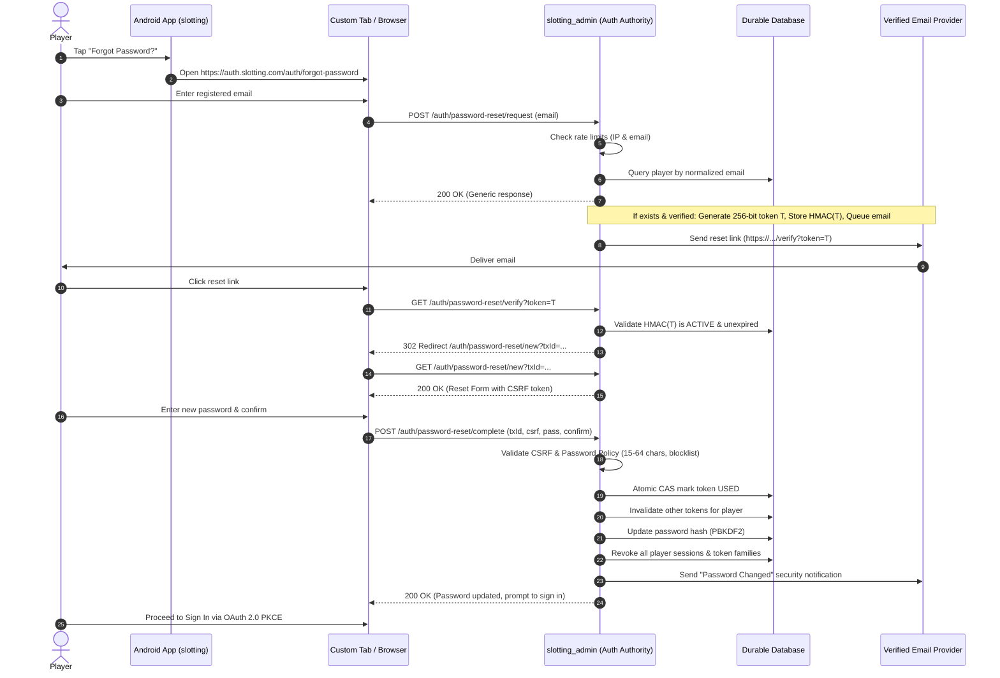

# ADR-007: Secure Single-Use Email Password Reset Architecture

## Status
Accepted

## Context
Account recovery is a high-risk security operation. Password reset vulnerabilities frequently lead to account takeovers through account enumeration, token guessing, token leakage via referrers or prefetching, link reuse, race conditions, or unrevoked active sessions.

The Slotting platform requires an account recovery mechanism that:
1. Protects against user enumeration (both timing and message enumeration).
2. Sends reset credentials exclusively to server-verified email addresses.
3. Generates cryptographically secure, high-entropy tokens and never stores raw tokens in persistent storage.
4. Defends against email prefetchers / link scanners destroying tokens before the player can interact.
5. Prevents open redirects, referrer leakage, clickjacking, and CSRF.
6. Enforces robust password policies (15–64 characters, Unicode, compromised blocklists).
7. Atomically redeems the token and invalidates all active player sessions, refresh-token families, authorization codes, and outstanding reset tokens.
8. Requires explicit re-authentication after reset without auto-login.
9. Integrates with the Android untrusted client without exposing reset tokens or credential entry inside mobile WebViews or native inputs.

## Decision

### 1. Trusted HTTPS Authentication Origin & External Browser Handoff
- Android client (`slotting`) displays a "Forgot Password?" button on unauthenticated login views.
- Clicking "Forgot Password?" directs the user to the trusted authentication origin (`https://auth.slotting.com/auth/forgot-password`) via Android Custom Tabs or external system browser.
- Credentials and reset tokens never enter the Android runtime, Keystore, or local storage.

### 2. Verified Email Destination & Account Enumeration Defense
- Client submits only `{ "email": "..." }` to `POST /auth/password-reset/request`.
- The backend normalizes the email, searches internal player records, and strictly checks if the player email is verified (`emailVerified == true`).
- If the account does not exist, is suspended, or has an unverified email, the system safely exits without queuing an email.
- The HTTP response is identical across all cases:
  `200 OK`: `{"status":"ACCEPTED","message":"If an account exists for that email address, password reset instructions will be sent shortly."}`
- Public response behavior uses timing-safe uniform processing; outbound email dispatch is asynchronous and queued out-of-band.

### 3. Cryptographic Token Generation & Peppered HMAC Storage
- Reset tokens are generated using `SecureRandom` with 256 bits (32 bytes) of cryptographic entropy, encoded as unpadded Base64URL.
- Raw reset tokens are NEVER persisted in the database.
- The database stores `token_hash = HMAC-SHA-256(pepper, rawToken)` where `pepper` is a high-entropy secret injected via environment variable (`SLOTTING_AUTH_PASSWORD_RESET_PEPPER`).
- Even in the event of an SQL read compromise or database backup leak, valid reset URLs cannot be derived.
- Reset tokens have a short validity window (default 90 seconds).

### 4. Link-Scanner / Prefetch Safe Landing
- Automated security scanners and mail clients often issue HTTP GET requests on links in incoming emails.
- An HTTP GET to `/auth/password-reset/verify?token=...` does NOT consume the reset token.
- Instead, the GET verifies the HMAC hash, generates an ephemeral server-side reset transaction with an associated anti-CSRF token, and redirects (`302`) to the clean URL `/auth/password-reset/new?txId=...`.
- This removes the raw token from the browser address bar, browser history, and outgoing Referer headers.

### 5. Atomic Redemption, Revocation, and Re-Authentication
- Form submission to `POST /auth/password-reset/complete` validates:
  - Ephemeral transaction ID and anti-CSRF token.
  - Password policy: minimum 15 characters, maximum 64 characters, non-blank, not in known compromised password blocklist.
  - Passwords match.
- Token consumption is performed atomically in the database (`UPDATE password_reset_token SET status='USED' WHERE id=? AND status='ACTIVE'`).
- Concurrently or subsequently:
  - All other active reset tokens for that player are marked `SUPERSEDED`.
  - Player password is updated using PBKDF2 (`PasswordKdfService`).
  - All existing player sessions, refresh-token families, and authorization codes are revoked across `DurableAuthStore` and `TokenStore`.
  - A security notification email is dispatched informing the user that their password was changed.
  - No automatic login is performed; the player must authenticate anew via standard OAuth 2.0 PKCE flow.

## Sequence Diagram

## Consequences
- Total immunity to user enumeration through timing and response uniformity.
- Immune to reset token leakage via database compromise, referrers, and browser histories.
- Link scanners cannot accidentally invalidate user reset links.
- Full revocation ensures compromised tokens or lost devices are instantly disconnected.
